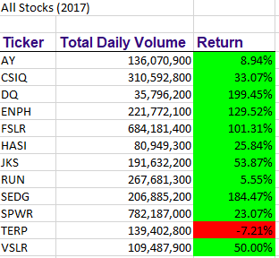
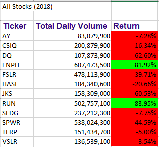

# stock-analysis
This analysis of 12 Wallstreet stocks aims to determine annual performance of each stock in 2017 and 2018 for the purpose of gaining a better understanding of whether investing in a particular stock would be a good decision.

## stock-analysis.xlsm file
### DQ Analysis
To begin this work, the subroutine "DQ Analysis" was written in VBA to analyze the stock, DAQO (DQ), for the year 2018. Total Daily Volume and Return were calculated.

The data indicates poor performance in 2018, showing a 62.6% loss, as summarized in the table below:
| Year | Total Daily Volume | Return |
|------|--------------------|--------|
| 2018 | 107,873,900 | -62.6%|

### All Stocks Analysis
The analysis of DQ was expanded upon so that all 12 stocks were included in the analysis for both years (2017 and 2018). The subroutine *AllStocksAnalysis()* was written in VBA to perform the analysis. Additionally, the subroutine *ClearWorksheet()* was written to clear the analysis from the output worksheet, **All Stocks Analysis**.

#### Explanation of VBA
The macro *AllStocksAnalysis()* involves the following variables:
* **yearValue** (values = "2017" and "2018")
* **tickers()** (array of 12 tickers defined 'As String')
* **startingPrice** (defined 'As Single')
* **endingPrice** (defined 'As Single')
* **ticker** (initialized as equal to the current ticker, tickers(i))
* **totalVolume** (initialized as equal to zero so that it can be used in a sum)
* **RowCount** (defined by formula to calculate number of rows in worksheet)
* **dataRowStart** (created for the output sheet for the purposes of applying conditional formatting)
* **dataRowEnd** (created for the output sheet for the purposes of applying conditional formatting)

The subroutine is broken down in the following steps:
1. The user types the year upon which to perform the analysis (i.e. the user defines yearValue as "2017" or "2018").
2. On the output worksheet "All Stocks Analysis" the following is defined:
    * The cell A1 value = "All Stocks (+ "yearValue" +)"
    * The cells A3, B3, and C3  represent the header row with the headings "Ticker", "Total Daily Volume", and "Return", respectively.
3. The array tickers(12) is defined as a string.
    * values = "AY", "CSIQ", "DQ", "ENPH", "FLSLR", "HASI", "JKS", "RUN", "SEDG", SPWR", "TERP", and "VSLR"
4. The variables startingPrice and endingPrice are initialized As Single.
5. The code activates the data worksheet upon which to run the analysis as defined by yearValue ("2017" or "2018").
6. The code determines the number of rows in the active data sheet upon which to run the analysis (using formula for calculating RowCount).
7. The code runs through the data for the array of tickers(12), and totalVolume is initialized as equal to zero.
    - The code loops through rows 2 to RowCount for each ticker()
        - **totalVolume** for each ticker() is defined by adding the value for volume (in column H of the raw data) when the value for "Ticker" (in column A of the raw data) is equal to the **ticker** (i.e. *tickers(i)*) value.
            - This is achieved by using a condition.
            - The value is able to be calculated since **totalVolume** was initialized as equal to zero before running the loop.
        - **startingPrice** is determined by taking the value for "Close" (in column F of raw data) when the value for "Ticker" (in column A of the raw data) in the current row is different than the value for "Ticker" (in column A of the raw data) in the previous row.
            - This is achieved by using a condition.
        - **endingPrice** is determined by taking the value for "Close" (in column F of raw data) when the value for "Ticker" (in column A of the raw data) in the current row is different than the value for "Ticker" (in column A of the raw data) in the next row.
            - This is achieved by using a condition.
8. The code populates the output for each ticker on the activated worksheet "All Stocks Analysis" as follows:
    - Under the heading "Ticker", populate the value for **ticker**
    - Under the heading "Total Daily Volume", populate the value for **totalVolume**
    - Under the heading "Return", populate the value for the formula **endingPrice** / **startingPrice** - 1

9. The output sheet is formatted as follows:
    - Number format for cells under the header Total Daily Volume is defined as "#,##0"
    - Number format for Return is defined as "0.00%" (percentage to the nearest hundreth)
    - Conditional formatting is applied to Return column from **dataRowStart** to **dataRowEnd** such that if the value is greater than zero, then the cell will be green; if the value is less than zero, then the cell will be red; otherwise, the cell will not be coloured.

#### Output
To run the *AllStocksAnalysis()* macro, the user clicks the button **Run All Stocks Analysis** on the **All Stocks Analysis** worksheet.

* When the user enters "2017", the following output is rendered:

    

* When the user enters "2018", the following output is rendered:

    

    NOTE: additional formatting for font and borders was applied which has not been menitoned in step 9

* To clear the worksheet (i.e. run the *ClearWorksheet()* macro), the user clicks the button **Clear Worksheet**.

#### Limitations
* This solution only is effective when the data itself are sorted first by ticker (i.e. column A of raw data), and then by date (i.e. column B of raw data).
    * It is important to note that the results rendered will not be accurate if the sort order is disrupted in any way.
* Furthermore, it is inefficient to loop through the entire dataset for each ticker.

## Challenge (All Stocks Analysis Refactored)

Given that the dataset only covers 12 stocks, the subroutine *AllStocksAnalysis()* runs without posing major performance issues. If this code were to run on a larger dataset, encompassing more tickers, it would be ideal to define a more efficient script that did not loop through the entire dataset for each ticker.

The goal is to refactor the code such that the output is achieved in a more efficient way.

The subroutine *AllStocksAnalysisRefactor()* was written in VBA to perform the analysis. Additionally, the subroutine *ClearWorksheet()* was reused to clear the analysis from the output worksheet, **All Stocks Analysis Refactored**.

#### Explanation of VBA
he macro *AllStocksAnalysisRefactor()* involves the following variables:
* **yearValue** (values = "2017" and "2018")
* **tickers()** (array of 12 tickers defined 'As String')
* **tickerStartingPrice()** (array of 12 starting prices defined 'As Single')
* **tickerEndingPrice()** (array of 12 ending prices defined 'As Single')
* **tickerVolume** (array of 12 volumes, initialized as equal to zero so that it can be used in a sum)
* **RowCount** (defined by formula to calculate number of rows in worksheet)
* **tickerIndex** (initialized as equal to 0)
* **dataRowStart** (created for the output sheet for the purposes of applying conditional formatting)
* **dataRowEnd** (created for the output sheet for the purposes of applying conditional formatting)

The subroutine is broken down in the following steps:
1. The user types the year upon which to perform the analysis (i.e. the user defines yearValue as "2017" or "2018").
2. On the output worksheet "All Stocks Analysis Refactored" the following is defined:
    * The cell A1 value = "All Stocks (+ "yearValue" +)"
    * The cells A3, B3, and C3  represent the header row with the headings "Ticker", "Total Daily Volume", and "Return", respectively.
3. The array tickers(12) is defined as a string.
    * values = "AY", "CSIQ", "DQ", "ENPH", "FLSLR", "HASI", "JKS", "RUN", "SEDG", SPWR", "TERP", and "VSLR"
4. The code activates the data worksheet upon which to run the analysis as defined by yearValue ("2017" or "2018").
5. The code determines the number of rows in the active data sheet upon which to run the analysis (using formula for calculating RowCount).
6. The variable **tickerIndex** (type = Integer) is initialized as equal to 0.
7. The following arrays are defined:
   * **tickerVolume(12)** As Long
   * **tickerStartingPrice(12)** As Single
   * **tickerEndingPrice(12)** defined As Single
8. The array **tickerVolume(i)** is initialized as equal to zero (for i = 0 to 11) such that each time the **tickerIndex** changes, **tickerVolume** will be calculated. (N.B. *tickerVolume(i)* needs to be initialized since it is calculated by sum).
9. The code loops through the data from rows 2 to **RowCount** calculating **tickerVolume**, **tickerStartingPrice**, and **tickerEndingPrice** each time **tickerIndex** changes.
    - **tickerVolume(tickerIndex)** (i.e. tickerVolume() for each ticker) is calculated by adding up the value for volume (in column H of the raw data) for each tickerIndex.
        - The value is able to be calculated since **tickerVolume** and **tickerIndex** were initialized as equal to zero before running the loop.
    - **tickerStartingPrice(tickerIndex)** is determined by taking the value for "Close" (in column F of raw data) when the value for **tickers(tickerIndex)** (in column A of the raw data) in the current row is different that of the previous row (in column A of the raw data).
        - This is achieved by using a condition.
    - **tickerEndingPrice** is determined by taking the value for "Close" (in column F of raw data) when the value for **tickers(tickerIndex)** (in column A of the raw data) in the current row is different that of the next row (in column A of the raw data).
        - This is achieved by using a condition.
        - **tickerIndex** changes (i.e. increases) when the tickerEndingPrice condition is met.
10. The code populates the output for each ticker on the activated worksheet "All Stocks Analysis Refactored" as follows:
    - Under the heading "Ticker", populate the value for **tickers()**
    - Under the heading "Total Daily Volume", populate the value for **tickerVolume**
    - Under the heading "Return", populate the value for the formula **tickerEndingPrice()** / **TickerStartingPrice()** - 1

11. The output sheet is formatted as follows:
    - Number format for cells under the header Total Daily Volume is defined as "#,##0"
    - Number format for Return is defined as "0.00%" (percentage to the nearest hundreth)
    - Conditional formatting is applied to Return column from **dataRowStart** to **dataRowEnd** such that if the value is greater than zero, then the cell will be green; if the value is less than zero, then the cell will be red; otherwise, the cell will not be coloured.

#### Output
To run the *AllStocksAnalysisRefactor()* macro, the user clicks the button **Run All Stocks Analysis Refactored** on the **All Stocks Analysis Refactored** worksheet.

* When the user enters "2017", the following output is rendered:

    

* When the user enters "2018", the following output is rendered:

    

    NOTE: additional formatting for font and borders was applied which has not been menitoned in step 9

* To clear the worksheet (i.e. run the *ClearWorksheet()* macro), the user clicks the button **Clear Worksheet**.

#### Observations
It is apparent that the performance of the subroutine *AllStocksAnalysisRefactor()* is sufficiently better, as results are rendered considerably faster when compared with the *AllStocksAnalysis()* subroutine.

The enhanced performance can be attributed to the fact that the code does not loop through the entire dataset for each ticker as it does in *AllStocksAnalysis()*; instead, it loops through each array of tickers, starting the next loop when the ticker index increases.

#### Limitations
* Like the *AllStocksAnalysis()* subroutine, this solution continues to rely on the data itself being sorted first by ticker (i.e. column A of raw data), and then by date (i.e. column B of raw data).
* It is important to note that the results rendered will not be accurate if the sort order is disrupted in any way.
    * This solution could also be enhanced by adding sorting to the macro up front
    * Alternatively, this solution could seek alternate ways to identify starting and ending prices for each ticker; however this would likely be more robust, and would evolve into a drastically different program in the end.
